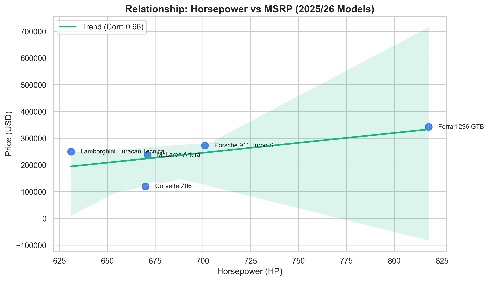

# Why Do Sports Cars Cost So Much? (Horsepower vs. Price)

I've always wondered if you're just paying for the brand when you buy a supercar, or if you're actually getting more "engine" for your money. So, I decided to pull some data on 5 of the biggest names in the game right now (2025/2026 models) and see how the math stacks up.

## The Goal
Simple: Is there a direct link between how much horsepower a car has and how much it costs? Or is brand prestige throwing everything off?

## What I Looked At
I picked five cars that are competing for the same set of eyeballs right now:
- **Porsche 911 Turbo S** (The daily driver's supercar)
- **Corvette Z06** (The American bargain)
- **Ferrari 296 GTB** (The hybrid powerhouse)
- **McLaren Artura** (The lightweight tech)
- **Lamborghini Huracan Tecnica** (The old-school V10 vibe)

## How I Did It
1. **Gathered the Numbers**: I grabbed the starting MSRP and Horsepower specs from current reviews and official sites.
2. **Ran the Math**: I used Python (Pandas) to find the "Correlation Coefficient"—basically a number that tells you how much these two things move together.
3. **Mapped it Out**: I made a scatter plot to see where each car sits on the "Value vs. Power" map.

## What I Found
- **The Link is Real**: I got a correlation score of **0.66**. That's a pretty strong "Yes"—more power usually means a higher price tag. 
- **The Corvette is a Steal**: Seriously. The Z06 has almost as much power as the European cars but costs less than half. It’s the massive outlier in the data.
- **You Pay for the Badge**: Ferrari and Lamborghini have a much higher "Price per HP." You aren't just buying speed; you're buying the name and the luxury.

## Technical Details
I built this using:
- **Python** (Pandas for the data, Seaborn for the plot)
- **Matplotlib** for the final touches.

---
*Created by Ibrahim.*
